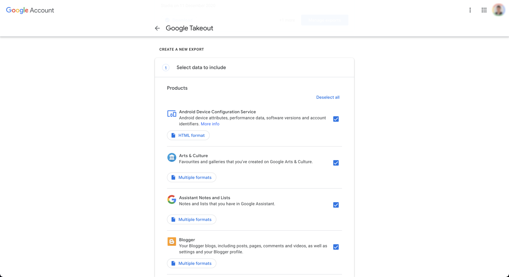
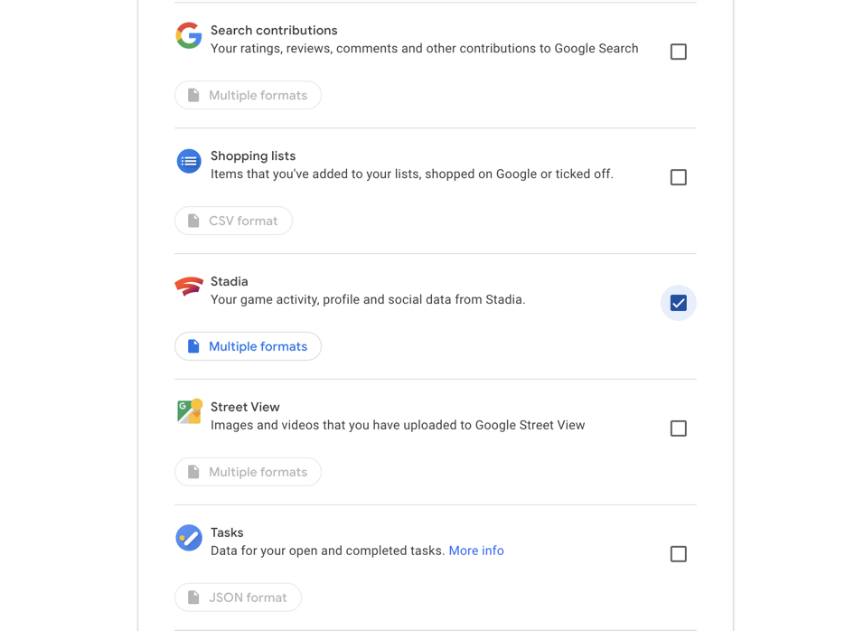
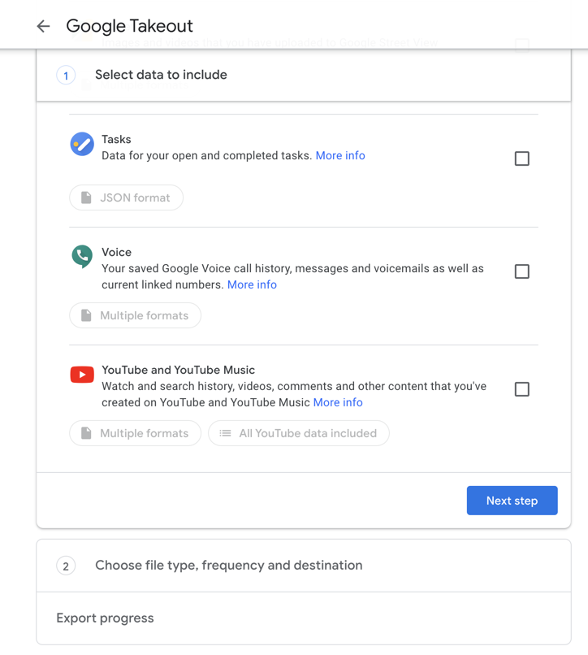
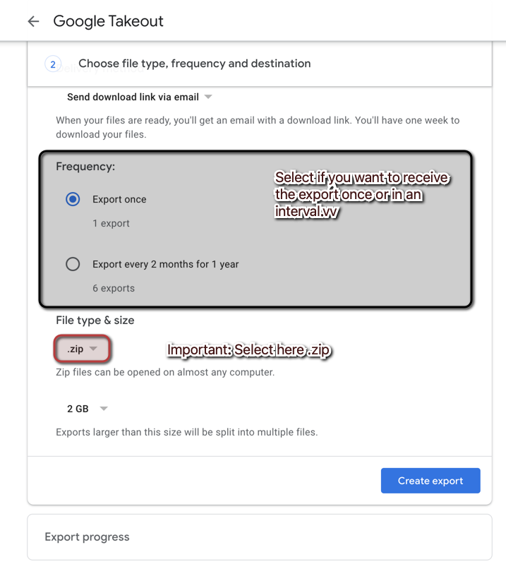
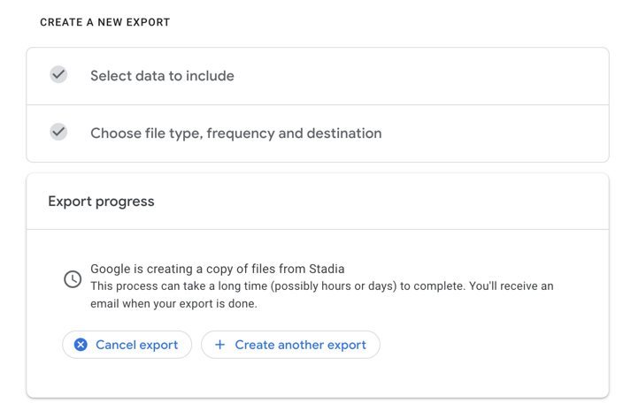
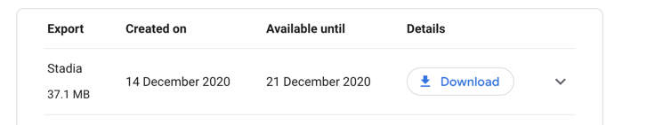

# How to make an Google Takeout export
In this document, you get to know, how to export a Google Takeout for Stadia file.

## First steps
Please make sure that you are currently signed in with your Google Account and open the website [takeout.google.com](https://takeout.google.com/).

In the first place you see, that all Google products are selected. Now click on the `Deselect` option on the right.

After that scroll down until you see the Google Stadia product and select just that.

Now scroll down and click on "Next step":

## Export the data
You now see some options, which you can optionally customize yourself. But please note: Select .zip as the export file type.

Finally click on "Export" and Google will start exporting the Stadia data.

## Download the export
Now if you wait, the site refreshes itself after it has finished the export. If you have a lot of data, it will may take some minutes. You will get notified by email, when the export has been finished.

Then you are able to download the export zip. Just click the "Download" button and it will save it.

This ZIP file can now be used to be uploaded on StadiStats.